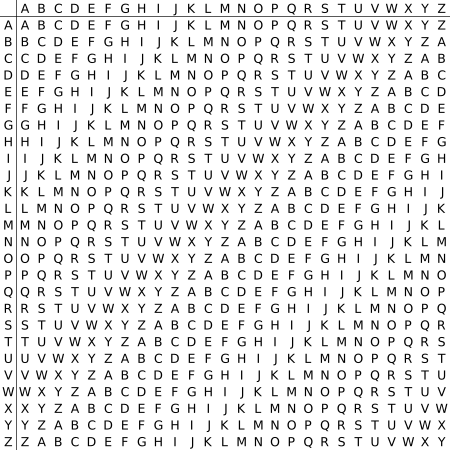

---title: myblog
# 编码解码

## 古典密码
### 凯撒密码
它是一种**替换加密**的技术，明文中的所有字母都在字母表上向后（或向前）按照一个固定数目进行偏移后被替换成密文。

例如，当偏移量是3的时候，所有的字母A将被替换成D，B变成E，以此类推。

这个加密方法是以罗马共和时期恺撒的名字命名的，当年恺撒曾用此方法与其将军们进行联系。
明文字母表：ABCDEFGHIJKLMNOPQRSTUVWXYZ

  密文字母表：DEFGHIJKLMNOPQRSTUVWXYZABC

  使用时，加密者查找明文字母表中需要加密的消息中的每一个字母所在位置，并且写下密文字母表中对应的字母。
  需要解密的人则根据事先已知的密钥反过来操作，得到原来的明文。例如：

  明文：HEETIAN LAB

  密文：KHHWLDQ ODE
  ### 维吉尼亚密码

是由一些偏移量不同的恺撒密码组成。

为了生成密码，需要使用**表格法**。

这一表格包括了26行字母表，每一行都由前一行向左偏移一位得到。具体使用哪一行字母表进行编译是基于密钥进行的，在过程中会不断地变换。


```

例如，假设明文为：HEETIAN

  然后选择某一关键词并重复而得到密钥，如关键词为LAB时，密钥为：LABLABL

  对于明文的第一个字母H，对应密钥的第一个字母L，于是使用表格中L行字母表进行加密，得到密文第一个字母S。
  类似地，明文第二个字母为E，在表格中使用对应的A行进行加密，得到密文第二个字母E。以此类推，可以得到：

  明文：HEETIAN

  密钥：LABLABL

  密文：SEFEIBY
  
  解密的过程则与加密相反。
  例如：根据密钥第一个字母L所对应的L行字母表，发现密文第一个字母S位于H列，因而明文第一个字母为H。
  密钥第二个字母A对应A行字母表，而密文第二个字母E位于此行E列，因而明文第二个字母为E。以此类推便可得到明文。
### 培根密码

培根密码的本质是将字母用一串二进制数替换，但是表示的过程中，没有采取0和1的形式，而使用a和b来代替


加密的过程首先将要加密的内容根据加密表里的内容进行替换，
如a用AAAAA替换，b用AAAAB替换。
替换完之后，我们可以把A和B当作两个不同的特征（如大写/小写，正体/斜体）带入到一个无关的句子中，
这就得到了我们加密后的结果。

其本质上是将二进制信息通过样式的区别，加在了正常书写之上。
培根密码所包含的信息可以和用于承载其的文章**完全无关**。

```
（1）   加密字符串heetian

（2）   根据加密表转换aabbb aabaa aabaa baabb abaaa aaaaa abbab

（3）   任选一句话，将a当作小写，b当作大写带入
```


### 栅栏密码

栅栏密码属于古典密码中最经典的**移项式密码**，同之前讲到的凯撒密码等替换式密码代表了密码学中最重要的两个概念

以2栏栅栏密码为例来讲解它的加密和解密过程。

  加密过程：

        明文：THERE_IS_A_CIPHER_
    
        两个一组，得到：(TH) (ER) (E_) (IS) (_A) (_C) (IP) (HE) (R_)
    
        先每组中取出第一个字母：TEEI__IHR
    
        再从每组中取出第二个字母：HR_SACPE_
    
        连在一起得到密文：TEEI__IHRHR_SACPE_

  解密过程：

        而解密的时候，先把密文从中间分开，变为两行：
    
        TEEI__IHR
    
        HR_SACPE_
    
        再按上下上下的顺序组合起来：
    
        THERE_IS_A_CIPHER_

  那么如何将2栏密码扩展到多栏呢？在之前的明文中，CIPHER这个单词之后加了一个下划线，
  目的就是为了让明文字符串的长度是2的倍数，
  栅栏密码的分栏的一个前提就是分的栏数需是明文长度的因数，这样才会使得分出来的每个栏长度都一样。

  对于多栏，我们还是用上面的例子来讲解。

  上面的明文字符串（THERE_IS_A_CIPHER_）的长度是18    


  所以我们可以把它分为2，3，4，6，9栏，这里我们以6栏为例。

  以每个元素相隔6个字符分割出栅栏。

        第一栏：TII
    
        第二栏：HSP
    
        第三栏：E_H
    
        第四栏：RAE
    
        第五栏：E_R
    
        第六栏：_C_

  连接在一起得到密文：TIIHSPE_HRAEE_R_C_

### 希尔密码


### Ascll

[ASCII码 - 基本ASCII码和扩展ASCII码,中文最全ASCII码对照表0~255 (asciim.cn)](https://www.asciim.cn/)


### base16

　1.使用**16个ASCII可打印字符**（数字0-9和字母A-F），对任意字节数据进行编码。称 HEX (十六进制)，是不区分大小写的十六进制编码标准

​    2.先获取输入字符串每个字节的二进制值（不足8比特在高位补0），然后将其串联进来，再按照4比特一组进行切分，将每组二进制数分别转换成十进制。

　 3.Base16编码后的数据量是原数据的两倍：1000比特数据需要250个字符（即 250*8=2000 比特）。

**流程**：给定的字符串根据Ascll标转化成二进制-->重新划分-->再转化为16进制

**注**：可以看到8比特数据按照4比特切分刚好是两组，所以Base16不可能用到填充符号“=”。
　　换句话说：Base16使用**两个ASCII字符去编码原数据中的一个字节数据**。

**例：**

|          | H            | e          | l          | l          | o          |
| -------- | ------------ | ---------- | ---------- | ---------- | ---------- |
| Ascll    | 72           | 101        | 108        | 108        | 111        |
| 二进制   | 01001000     | 01100101   | 01101100   | 01101100   | 01101111   |
| 重新划分 | 0100    1000 | 0110  0101 | 0110  1100 | 0110  1100 | 0110  1111 |
| 编码后   | 4        8   | 6       5  | 6      C   | 6       C  | 6        F |

### base32

​    **1**.Base32编码是使用**32个可打印字符（字母A-Z和数字2-7）**对任意字节数据进行编码的方案，编码后的字符串不用区分大小写并排除了容易混淆的字符，可以方便地由人类使用并由计算机处理。(1和L区分)

   **2**.Base32主要用于编码二进制数据，但是Base32也能够编码诸如ASCII之类的二进制文本。

   **3**.Base32将任意字符串按照字节进行切分，并将每个字节对应的二进制值（不足8比特高位补0）串联起来，**按照5比特一组进行切分**，并将每组二进制值转换成十进制来对应32个可打印字符中的一个。

由于数据的二进制传输是按照8比特一组进行（即一个字节），因此Base32按5比特切分的二进制数据必须是**40比特的倍数（5和8的最小公倍数）**。

**流程**：给定的字符串根据Ascll标转化成二进制-->重新划分-->再根据码表转换

**重新划分**：划分时最后不够5的后面先补0，总体不够**40比特的倍数**的补等号（一个等号就是5bit）

**例：**

|        |    C     |    t     |    f     |
| :----: | :------: | :------: | :------: |
| Ascll  |    67    |   116    |   102    |
| 二进制 | 01000011 | 01110100 | 01100110 |

Ctf-->IN2GM===

**码表**


### base64

  Base64是一种基于64个可打印字符来表示二进制数据的表示方法。由于，所以每6个比特为一个单元，对应某个可打印字符。3个字节有24个比特，对应于4个Base64单元，即3个字节可由4个可打印字符来表示。

   由于数据的二进制传输是按照8比特一组进行（即一个字节），因此Base64按6比特切分的二进制数据必须是24**比特的倍数（8和6的最小公倍数）**。

**流程：**给定的字符串根据Ascll标转化成二进制-->重新划分-->再根据码表转换

**重新划分：**划分时最后不够6的后面先补0，总体不够24**比特的倍数**的补等号（一个等号就是6bit）

**码表：**


**例：**


### base58

   Base58 编码是一种用于将数据表示为 ASCII 字符串的编码方法，主要用于简化区块链和加密货币中地址的可读性。它通过将二进制数据转换为一个较为紧凑的字符串形式，避免了一些在使用其他编码方法（如 Base64）时可能出现的字符，例如空格和其他容易混淆的字符。以下是 Base58 编码的基本原理和步骤：
